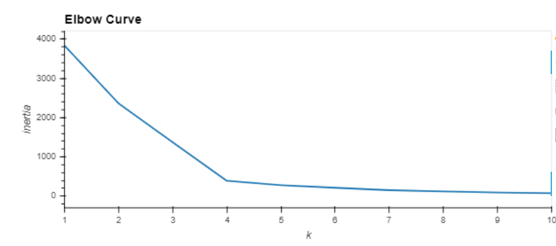
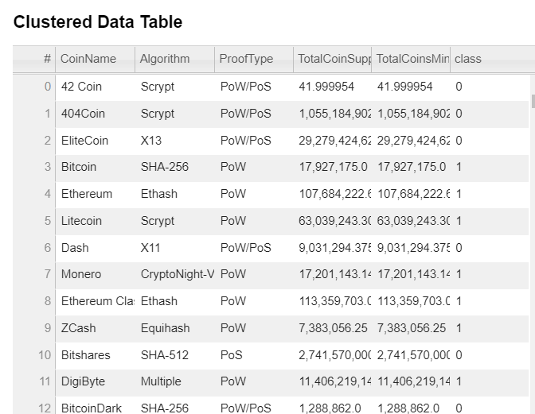
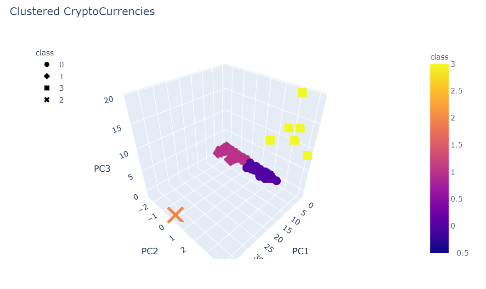
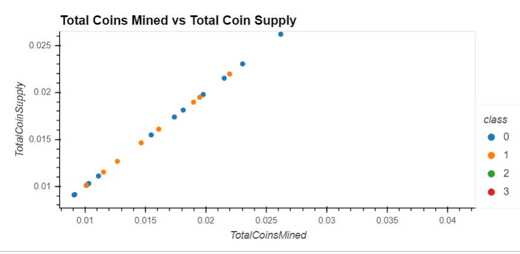

# Cryptocurrencies
This analysis uses unsuperivised machine learning to evaluate cryptocurrencies.  Data from CryptoCompare is dimensionally reduced using PCA (Principal Component Analysis) from sklearn and clustered using the K-means algorithm from also from sklearn.  The results of the prediction and clustering is presented with hvplot charts.  This analysis can be used to group cryptocurrencies for investment portfolios.

# Explanation of Processing
The csv data is read into a DataFrame and then cleaned for processing.  
- Drop any rows that aren't trading then drop the IsTrading columns since it is string data
- Drop any rows that have null/NaN 
- Drop any rows that have no coins mined
- Remove the CoinName column but save it in a new DataFrame for later processing.
- Convert the TotalCoinSupply to numeric so it can be used for a fit/transform later
- Result is the crypto_df DataFrame
- Use get_dummies to create separate variable for each "Algorithm" and "ProofType" and put into new DataFrame
- Scale the data so it can be processed
- Reduce the data dimensions with PCA so we have three columns of Principal Component data
- Run the new data dimensions through K-means algorithm to cluster the data after using an elbow cureve to determine the number of clusters

- Add the new 'class' to the DataFrame
- Result is the clustered_df DataFrame
- Join the crypto_df and the clustered_df and then the coinsName_df
- Result is the new clustered_df

This is a table of the final data created with hvplot.

This is a 3D scatter plot of the data created with hvplot.

This is a scatter plot of Total Coins Mined vs Total Coin supply created with hvplot.

## Resources
- Python 3.7 in Jupyter Notebook
- Libraries: pandas, numpy, path, counter
  - scikit-learn: StandardScaler, MinMaxScaler, PCA, KMeans
  - hvplot
  - ploty express
- Data: crypto_data.csv from CryptoCompare

